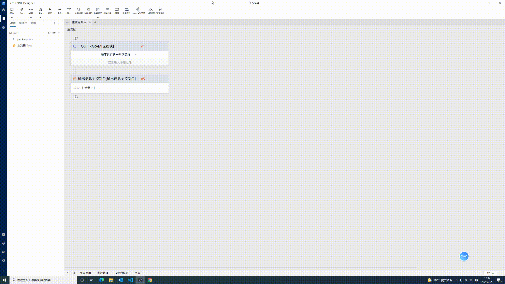

# source-inspector

* Inspect html elements' source code in IDE



```bash
npm install source-inspector --save-dev
```

### Note!!
**You may need to install the launch command line of your IDE**
- [For webstorm](https://github.com/yyx990803/launch-editor/issues/4#issuecomment-359348189) 
- [For vscode](https://code.visualstudio.com/docs/setup/mac#_launching-from-the-command-line)

## Webpack（version 4 or 5）

```js
const SourceInspectorWebpackPlugin = require('source-inspector/webpack')

module.exports = {
  entry: 'index.js',
  output: {
    path: __dirname + '/dist',
    filename: 'index_bundle.js'
  },
  plugins: [
    new SourceInspectorWebpackPlugin({
        hotKey: "Alt" // trigger inspector
    })
  ]
}
```

## Vite

```js
import SourceInspectorPlugin from "source-inspector/vite";

export default defineConfig({
  plugins: [SourceInspectorPlugin()]
});

```

### `Support react and vue`
